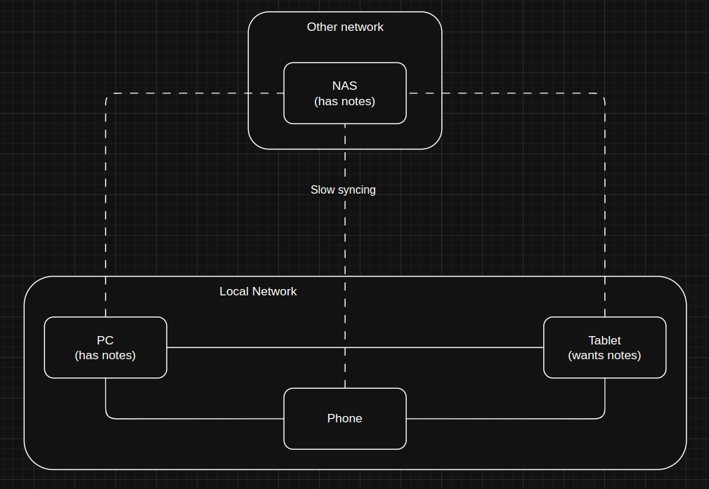

# SymDirs
C# console application to manage hard links and keep them synced

## SymDirDaemon
The SymDirDaemon is a new mode of SymDirs which is currently in development.
The goal is to keep multiple folders on the same device in sync with each other by using hard links.
It will automatically detect changes in one of the folder and apply them to the others.

All this without storing multiple copies of the same file on the device as hard links will just reference the same bytes on the drive.

### How?
You can specify a source directory (=Folder in Syncthing). This folder can then be synced with a target directory (=Device).
The synced folder will then be a subfolder of the target directory.
Therefore you can e. g. have one folder you Sync to your phone and then just link everything you want on your phone with that one target folder.
This eliminates the need to sync multiple folders in Syncthing. Instead you'll just have one which also syncs back to the folder on your pc (phone -> syncthing on phone -> syncthing on pc -> sync with source directory via SymDirs).

SymDirs uses hard links to link the files in the source directory to the target directory. Syncthing does not support Symbolic links of folder atm, therefore the need to have a daemon which syncs hard links.

A FileSystemWatcher is used to detect changes in any of the directories.

### Integration with Syncthing
SymDirs needs to integrate with Syncthing to keep the folders in sync.

Let's assume following Syncthing topology:

Furthermore, let's assume all SymDirs configuration changes are done via a Website on the NAS.

When you add the Tablet target to the notes source on the NAS the following would happen:
1. NAS creates a link from the notes source to the tablet target
2. Syncthing detects the notes folder and starts syncing it to the tablet

The issue here is that the NAS only syncs slowly to the tablet due to a slow internet connection.

Wanted behavior:
1. NAS creates a link from the notes source to the tablet target
2. The config change is synced to PC via Syncthing
3. The PC detects the config change and creates a link from the notes source to the tablet target
4. The PC and NAS start syncing the notes folder to the tablet via Syncthing

This way the tablet can receive the notes folder quickly from the PC via the local network.

This requires each source folder to have a unique ID which is used to identify the folder in SymDirs.
Every device needs to keep a list of local paths for the folder IDs so automatic syncing can be done.

### Shared Config
- Folder ids for source and target folders
- Active links between source and target folders

### Per Device config
- Path to folder id mapping

### Folder Marker
A folder marker will be used to identify a folder's id. ONLY if the folder marker id matches the folder id will SymDirs perform operations on it.

**Name**: `.symdirs`

## Original Intention
I have a video library on my PC I wanna share with my tablet and phone for on the go watching. To do this I use SyncThing.

Thus I want to have a folder on my PC that contains all the videos I want to share. Then also folders which I sync to my phone and tablet.

SymDirs allows to manage links from my video folder to my syncing folders with low afford.

I use hard links for the files themselves as those allow to be synced via SyncThing. Symbolic links of directories are not supported by it.

## ToDo
- [x] Internal MySQL database with file system state (files + hashes + modified date + synced status)
- [ ] Sync algorithm
- [ ] Error tracking
- [ ] Folder marker
- [ ] Local path to ID mapping

### Why use SymDirs?
- No need to copy files
- You can add an entire folder to be synced with a few commands
- You can remove a folder from syncing with a few commands
- You can delete files on the client device without deleting them on the pc

## Usage
Run the program. UI is self explenatory.

### Important notes:
- When applying a configuration the current state of the source folder is copied to a target folder. Directories are created and files are linked via hard links. Thus the state of the source folder won't automatically be synced with the target folder. To fix this apply the configuration or run the program with `--apply`.